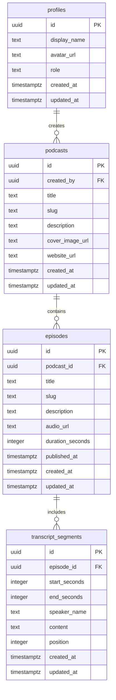

# Initial Database Schema

Status: Sprint 1 draft for Supabase Postgres.

This schema supports the Sprint 1 foundation: user profiles, podcasts, episodes, and transcript segments. It is intentionally narrow so the core product can ship before adding comments, discussion boards, prayer requests, groups, analytics, and moderation tooling in later sprints.

## Entity Overview



## Tables

### `profiles`

Purpose: public application profile for a Supabase Auth user.

Columns:

- `id uuid primary key references auth.users(id) on delete cascade`
- `display_name text not null`
- `avatar_url text`
- `role text not null default 'listener'`
- `created_at timestamptz not null default now()`
- `updated_at timestamptz not null default now()`

Constraints:

- `role` should be limited to `listener`, `pastor`, `moderator`, and `admin`.

Row-level security expectations:

- Anyone can read public profile basics needed for community features.
- A user can update only their own profile.
- Admin-only role changes should be handled by protected server-side logic later.

### `podcasts`

Purpose: podcast records that group episodes.

Columns:

- `id uuid primary key default gen_random_uuid()`
- `created_by uuid references profiles(id) on delete set null`
- `title text not null`
- `slug text not null unique`
- `description text`
- `cover_image_url text`
- `website_url text`
- `created_at timestamptz not null default now()`
- `updated_at timestamptz not null default now()`

Row-level security expectations:

- Anyone can read published podcast records.
- Authenticated users with elevated roles can create, update, or archive podcasts.
- Public creation should not be allowed in Sprint 1.

### `episodes`

Purpose: episode records belonging to a podcast.

Columns:

- `id uuid primary key default gen_random_uuid()`
- `podcast_id uuid not null references podcasts(id) on delete cascade`
- `title text not null`
- `slug text not null`
- `description text`
- `audio_url text`
- `duration_seconds integer`
- `published_at timestamptz`
- `created_at timestamptz not null default now()`
- `updated_at timestamptz not null default now()`

Constraints:

- Unique index on `podcast_id, slug`.
- `duration_seconds` should be positive when present.

Row-level security expectations:

- Anyone can read published episodes.
- Authenticated users with elevated roles can create or update episodes.

### `transcript_segments`

Purpose: timestamped transcript content for episode detail pages.

Columns:

- `id uuid primary key default gen_random_uuid()`
- `episode_id uuid not null references episodes(id) on delete cascade`
- `start_seconds integer not null`
- `end_seconds integer`
- `speaker_name text`
- `content text not null`
- `position integer not null`
- `created_at timestamptz not null default now()`
- `updated_at timestamptz not null default now()`

Constraints:

- Unique index on `episode_id, position`.
- `start_seconds` must be greater than or equal to `0`.
- `end_seconds` must be null or greater than `start_seconds`.

Row-level security expectations:

- Anyone can read transcript segments for published episodes.
- Authenticated users with elevated roles can create or update transcript segments.

## Draft SQL

```sql
create extension if not exists "pgcrypto";

create table public.profiles (
  id uuid primary key references auth.users(id) on delete cascade,
  display_name text not null,
  avatar_url text,
  role text not null default 'listener',
  created_at timestamptz not null default now(),
  updated_at timestamptz not null default now(),
  constraint profiles_role_check
    check (role in ('listener', 'pastor', 'moderator', 'admin'))
);

create table public.podcasts (
  id uuid primary key default gen_random_uuid(),
  created_by uuid references public.profiles(id) on delete set null,
  title text not null,
  slug text not null unique,
  description text,
  cover_image_url text,
  website_url text,
  created_at timestamptz not null default now(),
  updated_at timestamptz not null default now()
);

create table public.episodes (
  id uuid primary key default gen_random_uuid(),
  podcast_id uuid not null references public.podcasts(id) on delete cascade,
  title text not null,
  slug text not null,
  description text,
  audio_url text,
  duration_seconds integer,
  published_at timestamptz,
  created_at timestamptz not null default now(),
  updated_at timestamptz not null default now(),
  constraint episodes_duration_seconds_check
    check (duration_seconds is null or duration_seconds > 0),
  constraint episodes_podcast_slug_unique unique (podcast_id, slug)
);

create table public.transcript_segments (
  id uuid primary key default gen_random_uuid(),
  episode_id uuid not null references public.episodes(id) on delete cascade,
  start_seconds integer not null,
  end_seconds integer,
  speaker_name text,
  content text not null,
  position integer not null,
  created_at timestamptz not null default now(),
  updated_at timestamptz not null default now(),
  constraint transcript_segments_start_seconds_check
    check (start_seconds >= 0),
  constraint transcript_segments_end_seconds_check
    check (end_seconds is null or end_seconds > start_seconds),
  constraint transcript_segments_episode_position_unique unique (episode_id, position)
);
```

## Draft RLS Direction

Sprint 1 should enable RLS before real user data is stored.

Initial policy direction:

- `profiles`: public read, owner update.
- `podcasts`: public read, elevated-role write.
- `episodes`: public read, elevated-role write.
- `transcript_segments`: public read, elevated-role write.

The exact policies should be implemented after the role-management flow is confirmed, because pastor verification and moderation tools arrive in Sprint 3.

## Later Sprint Tables

Likely additions:

- `episode_comments`
- `comment_reactions`
- `discussion_threads`
- `discussion_replies`
- `saved_items`
- `prayer_requests`
- `groups`
- `group_members`
- `notifications`
- `moderation_actions`
